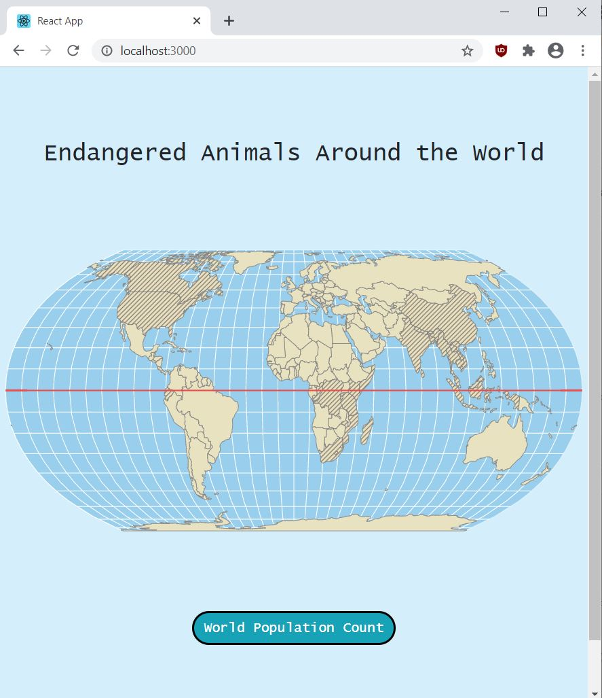

# Endangered_Animals
An interactive web app which showcases some of the endangered animals in the world. Developed using React, NodeJS, and MySQL. Utilizes the react-simple-maps library to display an interactive world map.

 \\

When a user hovers over a country, the country name appears.

 \\

When a user clicks a country, a popup box appears. The popup box contains information about endangered animals pertaining to the country.

 \\

Sources: \
https://www.iucnredlist.org/ \
https://www.worldwildlife.org/species/directory \
http://www.projectarkfoundation.com/ 
